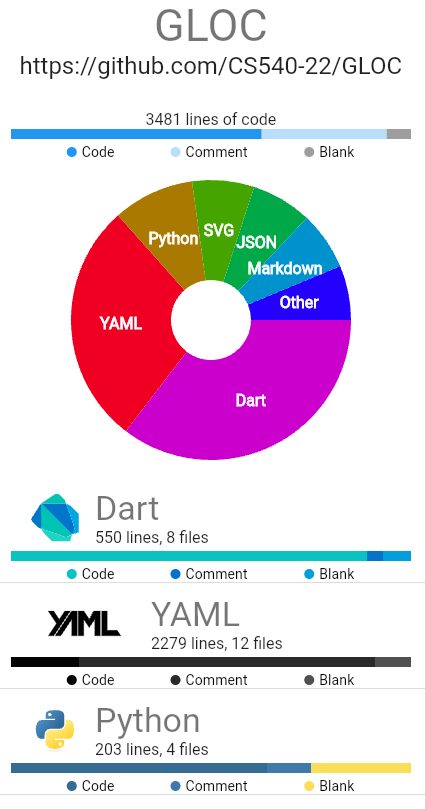
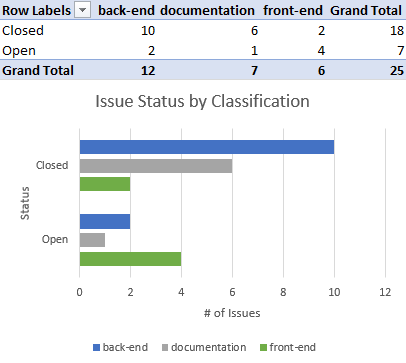

# Goal
- Create a reliable back end that counts lines of code
- Display results in an interactive front end

# Measurement
## Direct Measurement (Lines of Code)
Since we are building a tool that examines lines of code, we can use it on our project to get some insights.

While this data is easily measured, it may not tell us as much about the status and how close we are to reaching our goal. We can see that most of our code is in Dart which supports out Flutter front end. We can assume that as we make more progress on the front end, Dart lines of code will increase. One thing we do not know, is how many lines of code it will take to get a quality interface; especially since something like this is very subjective.

## Proxy Measurement (GitHub Issue Classification)
We compiled a list of all the GitHub issues created so far and classified them by front-end, back-end, or documentation. By plotting them on a chart by their status and classification, we can see what issues are getting closed and which ones are staying open.

According to our chart we can see that there is a large ratio of front-end issues that are still open compared the the back-end ones. We cant compare the number of issues in each classification since that can vary based on how specific they are and what they are tracking.

# Achieving Goals
Our back end is working pretty reliably at this point. Our front end needs some more features and polishing but we are focussing our efforts there to make sure we have something to present to the class. As we get closer to our goal, we should see the ratio of open to closed issues for the front end resemble that of the back end.